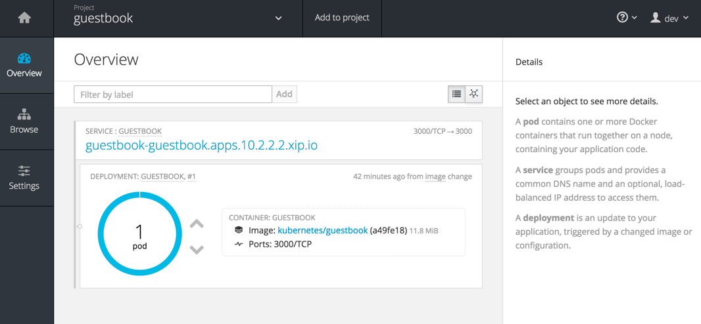
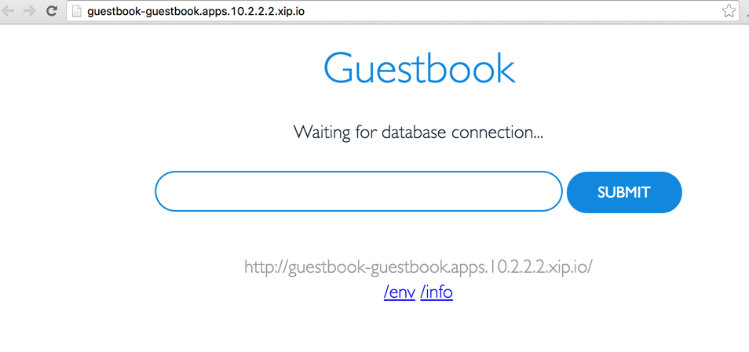

#** Lab 4: Creating Routes by Exposing Services **

###** Background: Routes **

By default, the `new-app` command does not expose the *Service* it creates to
the outside world. If you want to expose a *Service* as an HTTP endpoint you can
easily do this with a *Route*. The OpenShift router uses the HTTP header of the
incoming request to determine where to proxy the incoming request. You can
optionally define security, such as TLS, for the *Route*. If you want your
*Services*, and, by extension, your *Pods*,  to be accessible to the outside
world, you need to create a *Route*.

####**Exercise 2: Creating a Route**

Fortunately, creating a *Route* is a pretty straight-forward process.  You simply
`expose` the *Service*. First we want to verify that we don't already have any
existing routes:

````
$ oc get routes
   <no output>
````

Now we need to get the *Service* name to expose:

````
$ oc get services

NAME        CLUSTER-IP       EXTERNAL-IP   PORT(S)    AGE
guestbook   172.30.244.132   <none>        3000/TCP   31m
````

Once we know the *Service* name, creating a *Route* is a simple one-command task:

````
$ oc expose service guestbook
route "guestbook" exposed
````

Verify the *Route* was created with the following command:

````
NAME        HOST/PORT                                    PATH      SERVICE              TERMINATION   LABELS
guestbook   guestbook-guestbook.apps.10.2.2.2.xip.io             guestbook:3000-tcp                 app=guestbook
````

You can also verify the *Route* by looking at the project in the OpenShift web console:



Pretty nifty, huh?  This application is now available at the above URL:



**End of Lab 4**
