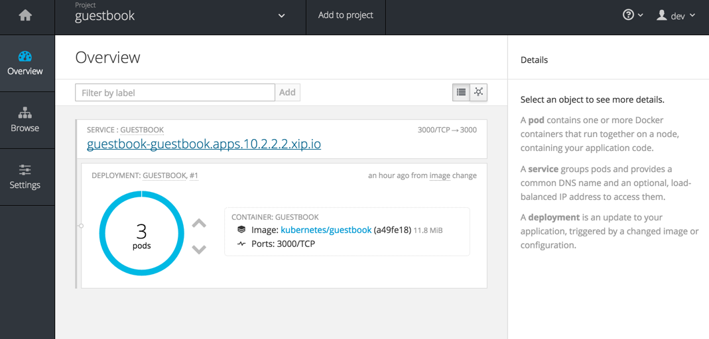

#** Lab 6: Scaling and Self Healing **

###** Background: Deployment Configurations and Replication Controllers **

While *Services* provide routing and load balancing for *Pods*, which may go in and
out of existence, *ReplicationControllers* (RC) are used to specify and then
ensure the desired number of *Pods* (replicas) are in existence. For example, if
you always want your application server to be scaled to 3 *Pods* (instances), a
*ReplicationController* is needed. Without an RC, any *Pods* that are killed or
somehow die are not automatically restarted, either. *ReplicationControllers* are
how OpenShift "self heals".

A *DeploymentConfiguration* (DC) defines how something in OpenShift should be
deployed. From the [deployments
documentation](https://docs.openshift.org/latest/architecture/core_concepts/deployments.html#deployments-and-deployment-configurations):

    Building on replication controllers, OpenShift adds expanded support for the
    software development and deployment lifecycle with the concept of deployments.
    In the simplest case, a deployment just creates a new replication controller and
    lets it start up pods. However, OpenShift deployments also provide the ability
    to transition from an existing deployment of an image to a new one and also
    define hooks to be run before or after creating the replication controller.

In almost all cases, you will end up using the *Pod*, *Service*,
*ReplicationController* and *DeploymentConfiguration* resources together. And, in
almost all of those cases, OpenShift will create all of them for you.

There are some edge cases where you might want some *Pods* and an *RC* without a *DC*
or a *Service*, and others, so feel free to ask us about them after the labs.

###** Exercise 3: Scaling up **
Now that we know what a *ReplicatonController* and *DeploymentConfig* are, we can
start to explore scaling in OpenShift Origin. Take a look at the
*DeploymentConfig* (DC) that was created for you when you told OpenShift to
stand up the `guestbook` image:

````
$ oc get dc

NAME        REVISION   REPLICAS   TRIGGERED BY
guestbook   1          1          config,image(guestbook:latest)
````

To get more details, we can look into the ReplicationController (*RC*).

Take a look at the *ReplicationController* (RC) that was created for you when you told OpenShift to
stand up the `guestbook` image:

````
$ oc get rc

NAME          DESIRED   CURRENT   AGE
guestbook-1   1         1         59m
````

Once you know the name of RC, you can use the following command:

````
$ oc get rc guestbook-1 -o json
````

For example, if you just want to see how many replicas are defined for the
`guestbook` image, you can enter in the following command:

````
$ oc get rc guestbook-1 -o json | grep -B1 -E "replicas" | grep -v "deployment"
````

**Note:** The above command uses the *grep* utility which may not be available on your operating system.  

The output of the above command should be:

````
    --
        "spec": {
            "replicas": 1,
    --
        "status": {
            "replicas": 1,
````

This lets us know that, right now, we expect one *Pod* to be deployed (`spec`), and we have
one *Pod* actually deployed (`status`). By changing the `spec`, we can tell OpenShift
that we desire a different number of *Pods*.

Ultimately, OpenShift Origin's autoscaling capability will involve monitoring the
status of an "application" and then manipulating the RCs accordingly.

You can learn more about the tech-preview CPU-based [Horizontal Pod Autoscaler
here](https://docs.openshift.org/latest/dev_guide/pod_autoscaling.html)

Let's scale our guestbook "application" up to 3 instances. We can do this with
the `scale` command. You could also do this by clicking the "up" arrow next to
the *Pod* in the OpenShift web console.

````
	$ oc scale --replicas=3 dc/guestbook
````

To verify that we changed the number of replicas by modifying the RC object,
issue the following command:

````
$ oc get rc

NAME        REVISION   REPLICAS   TRIGGERED BY
guestbook   1          3          config,image(guestbook:latest)
````

You can see that we now have 3 replicas.  Let's verify that with the `oc get pods` command:

````
$ oc get pods

NAME                READY     STATUS    RESTARTS   AGE
guestbook-1-afaxi   1/1       Running   0          1m
guestbook-1-e83hb   1/1       Running   0          1h
guestbook-1-vn9sx   1/1       Running   0          1m
````

And lastly, let's verify that the *Service* that we learned about in the previous lab accurately reflects three endpoints:

````
$ oc describe svc/guestbook
````

You will see something like the following output:

````
Name:			guestbook
Namespace:		guestbook
Labels:			app=guestbook
Selector:		app=guestbook,deploymentconfig=guestbook
Type:			ClusterIP
IP:			172.30.244.132
Port:			3000-tcp	3000/TCP
Endpoints:		172.17.0.13:3000,172.17.0.5:3000,172.17.0.6:3000
Session Affinity:	None
No events.
````

That's how simple it is to scale up *Pods* in a *Service*. Application scaling can
happen extremely quickly because OpenShift is just launching new instances of an
existing Docker image that is already cached on the node.

Verify that all three Pods are running using the web console:



###** Application "Self Healing" **
Because OpenShift's *RCs* are constantly monitoring to see that the desired number
of *Pods* actually is running, you might also expect that OpenShift will "fix" the
situation if it is ever not right. You would be correct!

Since we have three *Pods* running right now, let's see what happens if we
"accidentally" kill one. Run the `oc get pods` command again, and choose a *Pod*
name. Then, do the following:

````
$ oc delete pod guestbook-1-afaxi
````

Then, as fast as you can, do the following:

````
$ oc get pods
````

Did you notice anything different? The names of the *Pods* are slightly changed.
That's because OpenShift almost immediately detected that the current state (2
Pods) didn't match the desired state (3 Pods), and it fixed it by scheduling
another pod.

Additionally, OpenShift provides rudimentary capabilities around checking the
liveness and/or readiness of application instances. If OpenShift decided that
our `guestbook` application instance wasn't alive, it would kill or the instance
and then start another one, always ensuring that the desired number of replicas
was in place.

More information on liveness and readiness is available in the [Application
Health](https://docs.openshift.org/latest/dev_guide/application_health.html)
section of the documentation.

**End of Lab 6**
