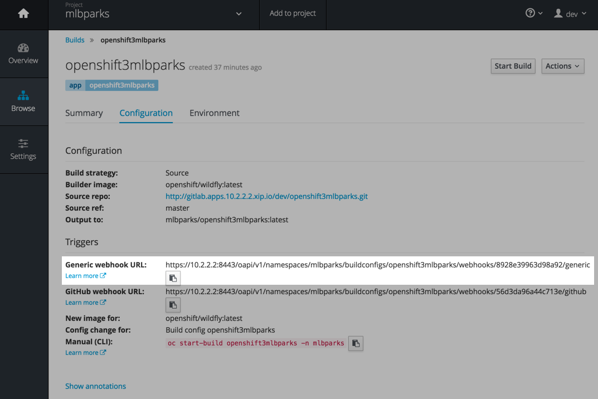
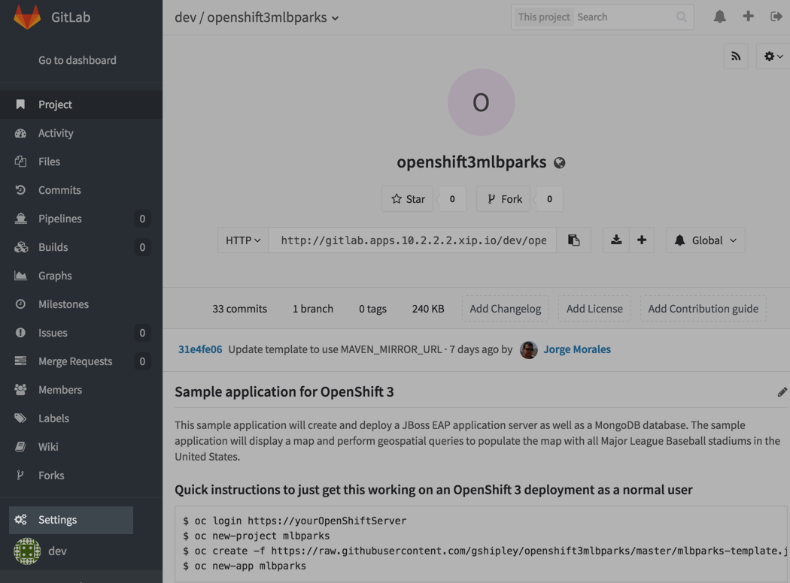
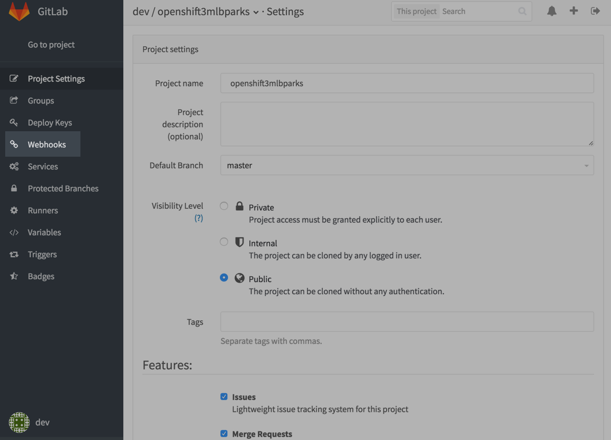
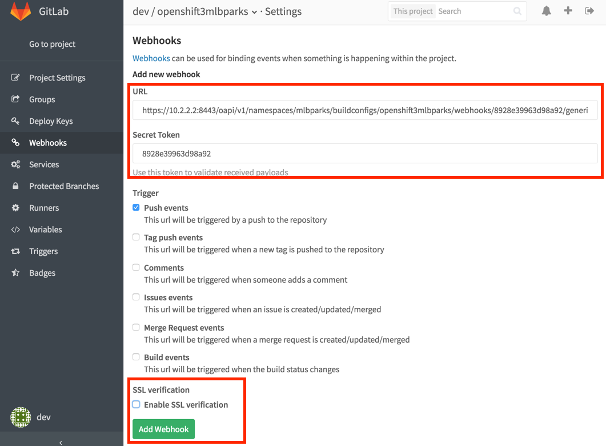
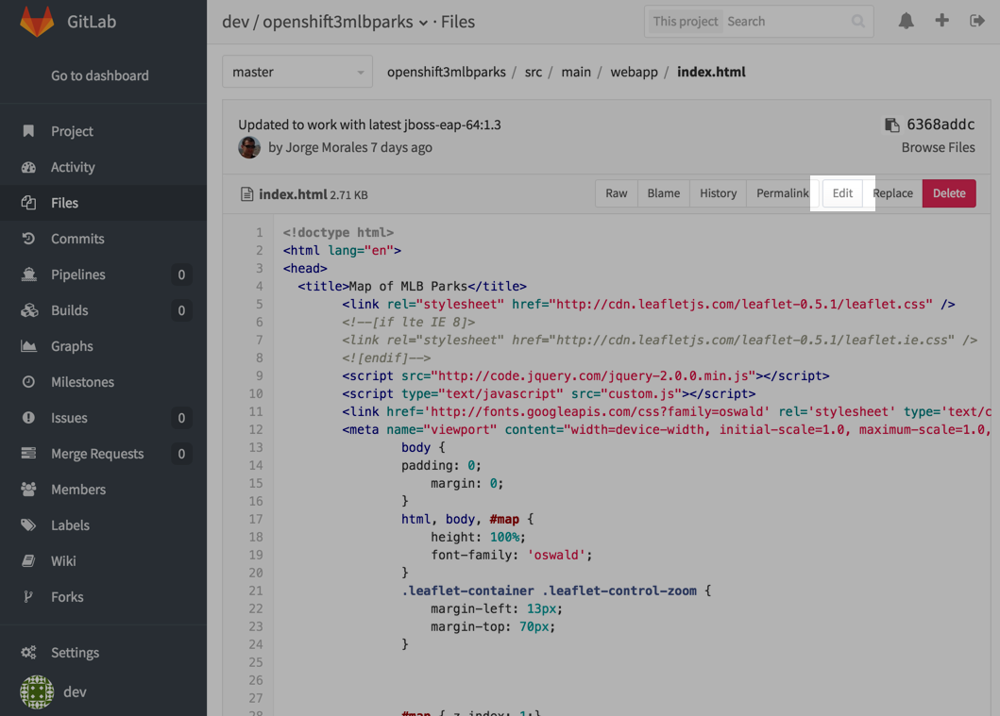
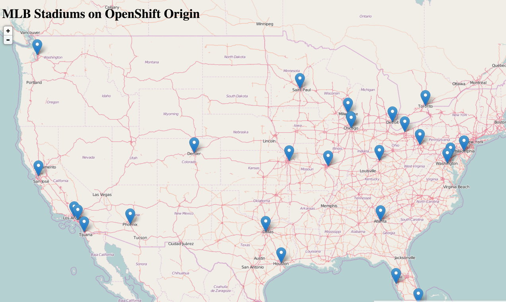

#** Lab 9: Making Code Changes and using webhooks**

####**Exercise: Using GitHub Web Hooks**

OpenShift 3 supports receiving webhooks from remote code repositories when code
changes, including from GitHub. When a notification is received, a new build
will be triggered on OpenShift. This allows for automated pipeline of
code/build/deploy.

In the OpenShift web console, navigate to your *userXX-mlbparks* Project, and
then mouse-over *Browse* and then *Builds*. Click the `openshift3mlbparks`
build.

On this screen you will see the option to copy the GitHub webhook URL as shown
in the following image:

Once you have the URL copied to your clipboard, navigate to the code repository
that you forked on GitHub. Remember, it probably looks like:

    https://github.com/USERNAME/openshift3mlbparks

Click the Settings link on the right hand side of the screen as shown in the
following image:

Click the Webhooks & Services link:

And finally, click on Add webhook.  On this screen, enter the URL you copied to
your clipboard from the OpenShift web console in the Payload URL box and ensure
that you disable SSL verification and save your changes:

Boom!  From now on, every time you commit new source code to your GitHub
repository, a new build and deploy will occur inside of OpenShift.  Let's try
this out.

Navigate to the */src/main/webapp* directory in your GitHub project and then
click on the *index.html* file.

Once you have the file on the screen, click the edit button in the top right
hand corner as shown here:

Change the following line (line number 34):

	<h1 id="title">MLB Stadiums</h1>

To

	<h1 id="title">MLB Stadiums - OpenShift Roadshow</h1>

**Note:** Ensure you are changing the h1 on line 34 and not the title element.

Click on Commit changes at the bottom of the screen.

Once you have committed your changes, a *Build* should almost instantaneously be
triggered in OpenShift. Look at the *Builds* page in the web console, or run the
following command to verify:

	$ oc get builds

You should see that a new build is running:

    NAME                   TYPE      STATUS     POD
    openshift3mlbparks-1   Source    Complete   openshift3mlbparks-1-build
    openshift3mlbparks-2   Source    Running    openshift3mlbparks-2-build

Once the build and deploy has finished, verify your new Docker image was
automatically deployed by viewing the application in your browser:

Winning!

####**Exercise: Rollback**

OpenShift allows you to move between different versions of an application without
the need to rebuild versions. Every version of the application exists as a Docker
image in the Docker Registry in OpenShift. Using the *oc rollback* and *oc deploy*
commands you can move back- or forward between various version of the application
in the registry.

In order to perform a rollback, you need to know the name of the *Deployment Config*
which has deployed the application:
    $ oc get dc

The output will be similar to the following:

    NAME       TRIGGERS                    LATEST
    mlbparks   ConfigChange, ImageChange   2

Now run the following command to rollback the latest code change:

    $ oc rollback mlbparks

    #3 rolled back to mlbparks-1
    Warning: the following images triggers were disabled: mlbparks
    You can re-enable them with: oc deploy mlbparks --enable-triggers -n demo

Once the deploy is complete, verify that the page header is reverted to the
original header by viewing the application in your browser.

**Note:** Automatic deployment of new images are disabled as part of the rollback
to prevent unwanted deployments soon after the rollback is complete. To re-enable
the automatic deployments run this:

    $ oc deploy mlbparks --enable-triggers

**End of Lab 9**
