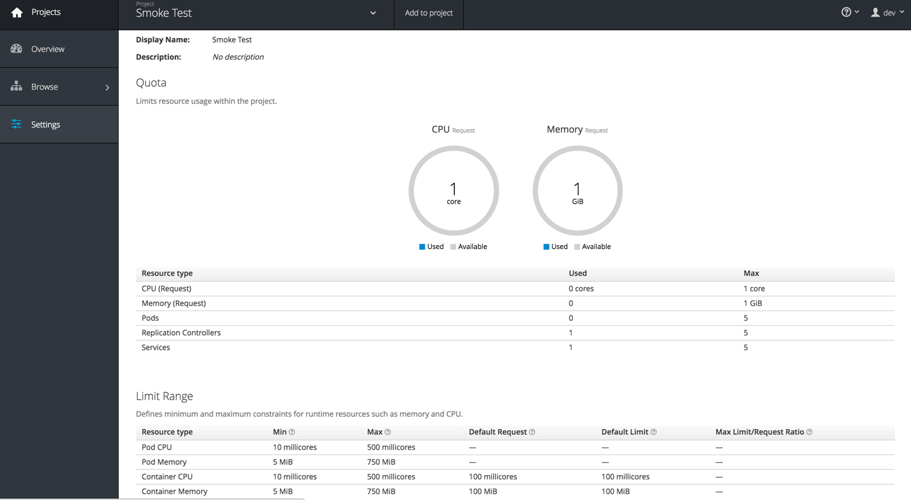
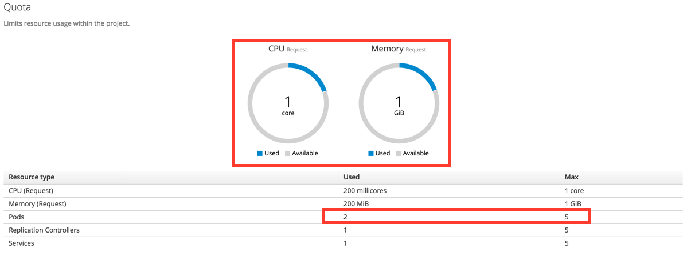
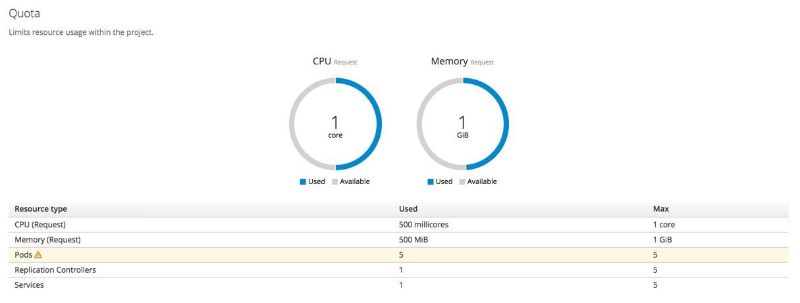

#** Lab 11: Quota**

Resource quota enables setting usage limits per project. It allows the admin to
limit the total number of pods and other type of objects created in a project as
well as the amount of resources (cpu, memory, etc) consumed by those objects.

After reaching the limit on an object type (e.g. pod), the server refuses to create
new pods within that project by displaying an appropriate error message to the
end-user.

Resource limits is another way to control consumption of resources within the
project by setting hard limits on how much compute resources a single Pod or
Container can consume.

We have defined in project `Smoke Test` some quota and resource limits.



####**Exercise: Hit the Limits!**

Since we have defined some quota and limits in our `Smoke Test` project, let's switch to it and experiment:

````
$ oc project smoke
````

Let's scale our application up and see what happens. Run the following to create more pods for the application:

````
$ oc scale dc/smoke --replicas=2
````


As can be seen, now we have an indication on the resources we are consuming and the percentage of the total.

Let's scale our application beyond those limits and see what happens. Run the following to create more pods for the application:

````
$ oc scale dc/smoke --replicas=6
````

OpenShift starts creating new pods and after a short while 5 pods will be created
however the number of pods never reaches to 6.


Go to project *Settings* and check out the resource limits. You should see a warning
triangle near Pods stating you have reached the max limit of 5 Pods in your project.



Check out *Browse* > *Events* in your project. You will see an event stating that
platform has failed to create new pods due to reaching a limit of 5 Pods.


**End of Lab 11**
